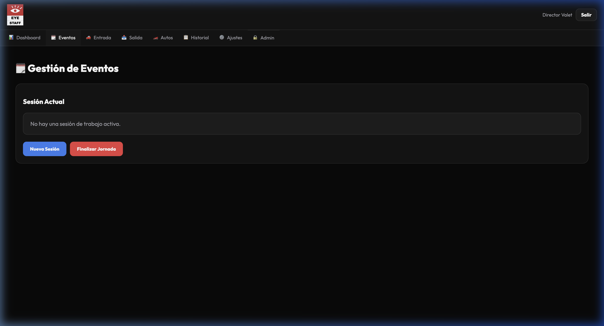

  

# Manual de Uso y Beneficios: Eye Staff (Perfil Dirección)

Bienvenido al manual de uso de **Eye Staff** diseñado específicamente para el equipo de Dirección. Esta herramienta ha sido desarrollada para centralizar, agilizar y transparentar toda la operación de nuestro personal (Valet, Guardias, Logística, etc.).

Como miembro de la Dirección, tienes un rol privilegiado dentro de la aplicación que te permite tener una visión global de las operaciones.

---

## 1. Beneficios Clave para la Dirección

El uso de Eye Staff transforma la manera en que gestionamos nuestros eventos y el personal, aportando los siguientes beneficios estratégicos:

**Visibilidad Global (360º)**
A diferencia del personal operativo que solo ve los servicios a los que está asignado, la Dirección tiene **acceso total** a todas las pestañas de servicio (Valet, Guardia, Logístico, etc.) sin importar si están inscritos o no. Esto permite una supervisión constante.

**Toma de Decisiones en Tiempo Real**
Al tener la información centralizada y actualizada al instante, puedes reasignar recursos, evaluar la cobertura de un evento y anticipar necesidades operativas antes de que se conviertan en un problema.

**Optimización y Reducción de Costos**
La automatización de procesos y el control exacto de asistencias y tiempos trabajados evitan errores de cálculo, horas extra innecesarias y fugas de presupuesto.

**Comunicación Oficial y Estandarizada**
Toda la información y notificaciones provienen de "EYE STAFF", manteniendo un estándar profesional (evitando correos personales o informales).

---

## 2. Posibilidades y Funciones Principales

Al ingresar con tu perfil administrativo/directivo, el sistema te otorga automáticamente permisos avanzados. Aquí te explicamos lo que puedes hacer:

### A. Supervisión de Eventos y Servicios
*   **Acceso Multidisciplinario:** Puedes navegar libremente por todas las categorías de servicios (Valet Parking, Seguridad/Guardias, Logística).
*   **Monitorización Activa:** Revisa qué eventos están activos, cuáles están programados y quién es el personal asignado a cada uno.

### B. Gestión de Personal (Staff)
*   **Directorio Completo:** Acceso a la base de datos de todo el personal operativo y administrativo. *(Nota: perfiles como ADMIN, RRHH, OPERACIONES, etc., están categorizados como corporativos y no aparecen en listas de personal de campo o cumpleaños).*
*   **Asignaciones y Roles:** Visualiza y ajusta los roles de cada empleado en los diferentes eventos.

### C. Reportes y Analítica
*   **Control de Horarios:** Supervisa la hora de entrada y salida del personal en los eventos para asegurar el cumplimiento.
*   **Exportación de Datos:** (Si aplica en tu panel) Generación de reportes para nóminas o evaluación de rendimiento.
*   **Zonas Horarias Oficiales:** Todos los reportes y fechas en el sistema están estrictamente unificados bajo la zona horaria oficial (`America/Caracas`), asegurando que no haya discrepancias en los registros sin importar desde dónde te conectes.

---

## 3. Mejores Prácticas para la Dirección

1.  **Revisión Diaria:** Ingresa al menos una vez al día al panel general para revisar el estatus de los eventos programados para la semana.
2.  **Gestión de Permisos:** Asegúrate de que los nuevos miembros del equipo administrativo reciban los roles correctos para mantener la integridad de la visibilidad.
3.  **Comunicación Centralizada:** Utiliza la plataforma para emitir comunicados operativos en lugar de usar canales informales.

---

*Para cualquier duda técnica o problema de acceso, por favor contacta al equipo de soporte de desarrollo (Valet Eye).*
